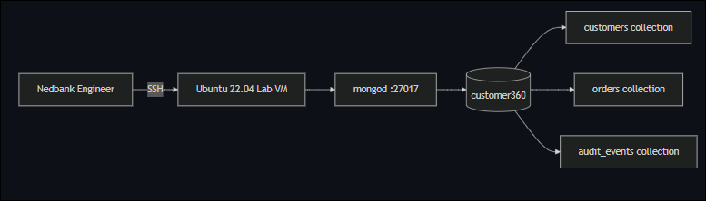
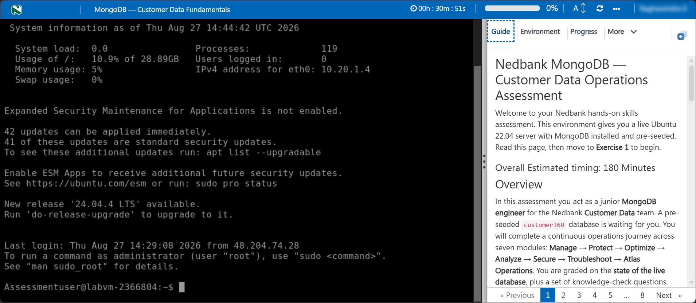
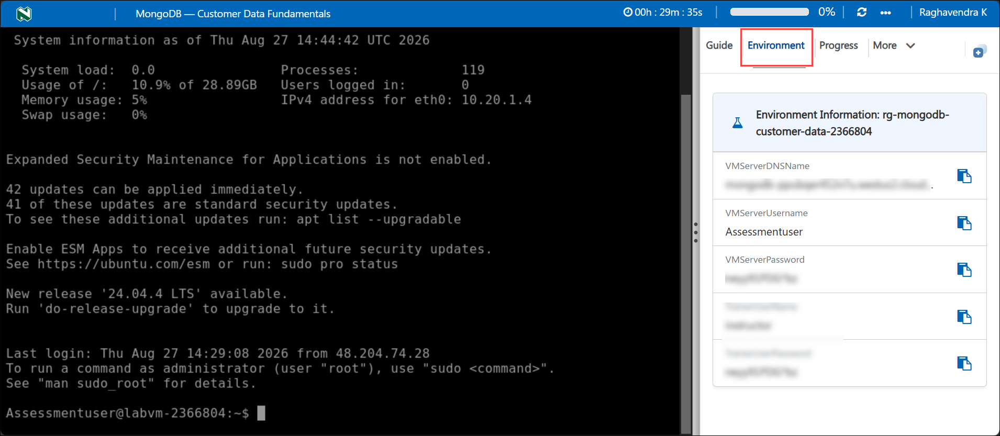

# Nedbank MongoDB — Customer Data Operations Assessment

Welcome to your Nedbank hands-on skills assessment. This environment gives you a live Ubuntu 22.04 server with MongoDB installed and pre-seeded. Read this page, then move to **Exercise 1** to begin.

### Overall Estimated timing: 180 Minutes

## Overview

In this assessment you act as a junior **MongoDB engineer** for the Nedbank **Customer Data** team. A pre-seeded `customer360` database is waiting for you. You will complete a continuous operations journey across seven modules: **Manage → Protect → Optimize → Analyze → Secure → Troubleshoot → Atlas Operations**. You are graded on the **state of the live database**, plus a set of knowledge-check questions.

## Objectives

By the end of this assessment you will have:

1. **Managed customer data** by inserting, querying, and updating documents with validation rules.
2. **Protected data** through backup and recovery procedures.
3. **Optimized performance** by creating indexes and analyzing query execution plans.
4. **Analyzed data** using aggregation pipelines for operational insights.
5. **Secured the database** by enabling authentication and implementing role-based access control.
6. **Troubleshot service issues** using Linux platform tools and MongoDB diagnostics.
7. **Operated MongoDB Atlas** in a cloud environment with proper security configuration.

## Pre-requisites

Basic working knowledge of MongoDB: mongosh shell, CRUD operations (`insertOne`, `find`, `updateOne`), index creation (`createIndex`), aggregation framework (`$match`, `$group`), and Linux command-line basics.

## Architecture

A single Ubuntu 22.04 virtual machine runs MongoDB Community Edition 7.0. The `customer360` database holds customer profiles, orders, and audit events seeded with realistic data.

 

## Getting Started with the lab

Your virtual machine and this **Guide** are available within your web browser. Use the **Split Window** button at the top-right to open the guide beside your terminal.

## Accessing Your Lab Environment

1. On your lab environment page, you will be automatically logged into the Lab Virtual Machine (LabVM) where you will perform the lab activities.

    

1. Find the **LabVM related details (2)** on the **Environment (1)** tab:

    

   - **LabVM Admin Username:** **<inject key="VMServerUsername" enableCopy="false"/>**
   - **LabVM Admin Password:** **<inject key="VMServerPassword" enableCopy="false"/>**
   - **LabVM DNS Name:** **<inject key="VMServerDNSName" enableCopy="false"/>**

1. Your lab environment unique id for this session is **<inject key="DeploymentID" enableCopy="false"/>** - quote it if you contact support.

## Track Your Progress

Use the **Validate** button on each task to check your work. The **Progress** tab shows your validation score; it reaches 100% when all task validations pass.

## Lab Duration Extension

You have **180 minutes**; the assessment is designed to take about **150**. If you need more time, click the **Hourglass** icon in the top-right of the lab environment (appears when 10 minutes remain) and click **OK**.

## Support Contact

The CloudLabs support team is available 24/7 via email and live chat.

- Email Support: labs-support@spektrasystems.com
- Live Chat Support: https://support.cloudlabs.ai/isv

Click **Next** to begin Exercise 1.

## Happy Assessing!!
